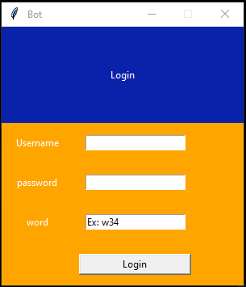
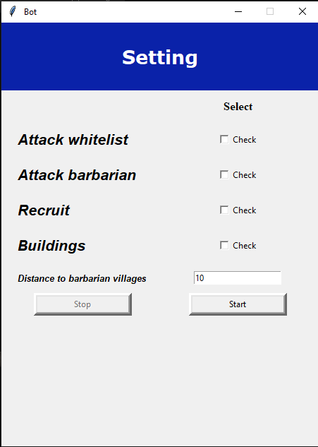

# TribalWars Bot

---

## Description

This is a simple tribalwars bot made in python just to learn more about coding. Work just with Firefox and  currently only to romanian server. Templates files are from dsx.

---

## How To Use
- Run from cmd `main.py`
- After start a login page will show
- 
- You need to use tribalwars account and word ex: `ro72`
- At settings page you need to check what to do `can select multiple actions`
- 
---
## Setting description
### Attack whitelist
Here you insert what villages to attack. Follow the instructions from whitelist.txt
### Attack barbarian
Bot will automatically find barbarian villages and will add to barbarii.txt. You need to specify distance in distance field. I recommend at least 10 or higher. 
### Recruit
In train.xml can specify what troops need to recruit. Bot will recruit numbers from train once to 30 min or higher. Also you can specify a buffer for another commands.
### Buildings
Not working right now
### Farm.xml
From here bot will know what troops to send in attacks. He will send from top to bottom. 

  `<units>` 
    `<spear>150</spear>` 
    `<sword>40</sword>` 
  `</units>` 
  `<units>` 
    `<axe>100</axe>` 
  `</units>` 
  `<units>` 
    `<light>4</light>` 
  `</units>` 
 In this example bot will try to xxx|xxx send first 150 spear and 40 sword if you in village have less troops he will jump to next units, axe in our example, if you don't have axe will jump to light and so on and so forth. 

